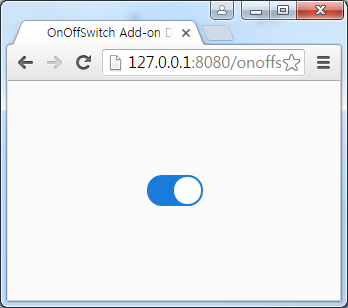
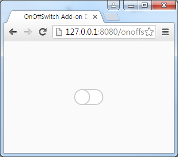

=  OnOffSwitch Add-on for Vaadin

CSS3 On/Off switches with animated transitions.

== OnOffSwitch Maven

[source,xml,indent=0]
----
<dependency>
	<groupId>com.vaadin.addon</groupId>
	<artifactId>vaadin-onoffswitch</artifactId>
	<version>${project.version}</version>
</dependency>

<repository>
   <id>vaadin-addons</id>
   <url>http://maven.vaadin.com/vaadin-addons</url>
</repository>
----

== OnOffSwitch Example Code

[source,java,indent=0]
----
OnOffSwitch onoffSwitch = new OnOffSwitch();

onoffSwitch.addValueChangeListener(new ValueChangeListener(){
    @Override
    public void valueChange(ValueChangeEvent event) {
        boolean checked = (boolean) event.getProperty().getValue();
        System.out.println("onoffSwitch checked : " + checked);
    }
});
----

## Building and running demo

[source,groovy,indent=0]
----
mvn clean install
mvn -pl onoffswitch-demo jetty:run
----

Demo Server : http://127.0.0.1:8080

== Building from source

requires Java SE 1.7.0_79+

requires Maven 3.3.9+

requires Tomcat 8.0.36+

requires Eclipse Mars.2 4.5.2+ 

requires Vaadin Framework 7.7.3+

== License & Author

Add-on is distributed under Apache License 2.0. For license terms, see LICENSE.txt.

